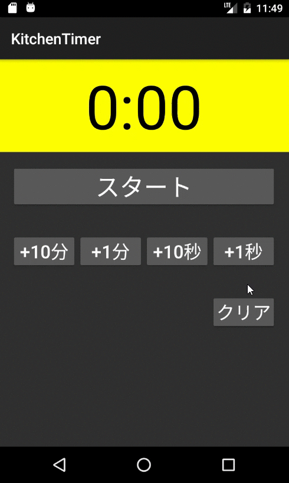

# KitchenTimer

ここにCIのバッチを貼りたい

「Xamarinネイティブによるモバイルアプリ開発」のキッチンタイマー

## Description

Androidで動くキッチンタイマー

***DEMO:***

## Features

- ここに特徴を書こう
- Xamarinはいいぞ

## Requirement

- 依存関係をここに書く
- NuGetから取ってきたパッケージの名前とか

## Usage

1. Visual Studioでプロジェクトを開きます
2. VisualStudio_android-23_x86_phone(Android 6.0 - API 23)とかで実行します
3. 時間を設定してスタート

## Installation

    $ ここにインストールに使うコマンドとかを書いたりする

## Anything Else

その他に書きたいことがあったら書く

## Author

[@science507](https://twitter.com/science507)

## License
[MIT License](LICENSE) みたいにライセンスを書こう